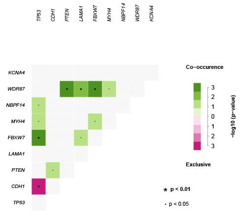

```{r, include = FALSE}
knitr::opts_chunk$set(
  collapse = TRUE,
  comment = "#>"
)
```

```{r setup}
library(SMDIC)
```


## 1 Introduce
SMDIC has three main functions (Figure 1): inference the relative abundance matrix of tumor-infiltrating immune cells, detection of differential immune cells with respect to a particular gene mutation status and construction of two binary matrices based on the abundance matrix of significant differential immune cell (one for up-regulated and one for down-regulated cells), identification of somatic mutation-driven immune cells by comparing the gene mutation status with each immune cell in the binary matrices. The above process would be repeated once for each mutation gene. SMDIC also provides visualization of the relative abundance of identified immune cells in the gene mutation status using heat maps, as well as the mutation genes correlated with immune cells using waterfall plot and mutually exclusive or co-occurring plot.
    Here, we developed a software package (SMDIC) to automated identification of Somatic Mutation-Driven Immune Cell. The operation modes including: i) inferring the relative abundance matrix of tumor-infiltrating immune cells and integrating it with a particular gene mutation status, ii) detecting differential immune cells with respect to the gene mutation status and converting the abundance matrix of significant differential immune cell into two binary matrices (one for up-regulated and one for down-regulated cells), iii) identifying somatic mutation-driven immune cells by comparing the gene mutation status with each immune cell in the binary matrices across all samples, and iv) visualization of immune cell abundance of samples in different mutation status. Its capabilities enable SMDIC to identify somatic mutation-specific immune cell response. SMDIC may contribute to find neoantigens to facilitate the development of tailored immunotherapy for patients with cancer.
    

```{R}
knitr::include_graphics("../inst/workflow.jpg")
```


This vignette illustrates how to easily use the SMDIC package. With the use of functions in this packages, users could identify the immune cells driven by somatic mutations in tumor microenvironment.

+  This package provides the `exp2cell` function  use gene expression profile to quantify cell abundance matrix.

+   This package provides the `maf2matrix` function use mutation annotation file (MAF) format data to build a binary mutations matrix.

+  This package provides the `mutcorcell` function to identify the immune cells driven by somatic mutations in tumor microenvironment . 

+  This package provides the `plotwaterfall` function to plot the waterfall for mutation genes which drive immune cells.

+  This package provides the `plotinteractions` function to plot the co-occurrence and mutual exclusivity plots for mutation genes which drive immune cells.

+  This package provides the `heatmapcell` function to draw clustered heatmaps for the cells driven by a somatic mutation.

+  This package provides the `survcell` function to draw Kaplan–Meier curves for survival in the above-median and below-median groups for cell risk score.


## 2 Example: Inference the relative abundance matrix of immune cells
We can use function `GetExampleData` to return example data and environment variables.

```{r echo = T, results = 'hide'}
library(SMDIC)
library(GSVA)
exp.example<-GetExampleData("exp.example") # obtain example expression data 
cellmatrix<-exp2cell(exp.example,method="ssGSEA") #Cell abundance matrix,method must be one of "xCell","ssGSEA" and "CIBERSORT".

```
```{r}
#view first six rows and six colmns of cell infiltration score matrix.
cellmatrix[1:6,1:6]
```


## 3 Example: Use mutation annotation file (MAF) format data to build a binary mutations matrix

We extract the non-silent somatic mutations (nonsense mutation, missense mutation, frame-shif indels, splice site, nonstop mutation, translation start site, inframe indels) in protein-coding regions, and built a binary mutations matrix, in which 1 represents any mutation occurs in a particular gene in a particular sample, otherwise the element is 0. The genes with a given mutation frequency greater than a threshold value one precent as the default value) are retained for the following analysis. 
```{r}

maf <- system.file("extdata","example.maf",package = "SMDIC") #get path of the mutation annotation file.
mutmatrix.example<-maf2matrix(maf) 
head(mutmatrix.example)
```


## 4 Example: Identification of somatic mutation-driven immune cells.

Function `mutcorcell` detects the differential immune cells with respect to a particular gene mutation status and construction of two binary matrices based on the abundance matrix of significant differential immune cell (one for up-regulated and one for down-regulated), identification of somatic mutation-driven immune cells by comparing the gene mutation status with each immune cell in the binary matrices. 

```{r import, results = "hide"}
#prepare data for following analysis.
cellmatrix<-GetExampleData("cellmatrix") # obtain example result from real rasult: cell abundance matrix from real data.
mutmatrix<-GetExampleData("mutmatrix")# select mutmatrix example result from real result: a binary mutations matrix
mutcell<-mutcorcell(cell = cellmatrix,mutmatrix = mutmatrix,fisher.adjust = TRUE)
```

result mutcell include three matrices:mut_cell is a binary numerical matrix which shows the immune cells driven by somatic mutation;mut_cell_p is a numerical matrix which shows pvalue of the immune cells driven by somatic mutation;mut_cell_fdr is a numerical matrix which shows fdr of the immune cells driven by somatic mutation.
```{r}
#view first ten rows and six colmns of mutcell matrix.
mutcell$mut_cell[1:6,1:6]
#mutcell$mut_cell_p
#mutcell$mut_cell_fdr
```


Function `mutcellsummary` produces result summaries of the results of function `mutcorcell` function.
```{R echo=TRUE}
summary<-mutcellsummary(mutcell =mutcell,mutmatrix = mutmatrix,cellmatrix = cellmatrix)# The summary have four columns.The first column are gene names,the second column are the cells driven by the gene,the third column are the number of cells driven by the gene,the fourth column are mutation rates of gene.
head(summary)
```

Function `gene2cellsummary` produces result summaries of the immune cells driven by a somatic mutation.

```{R}
gene2cellsummary(gene="TP53",method="xCell",mutcell = mutcell) #a matrix shows the short name, full name, pvalue, fdr of the cells driven by a somatic mutation
```

## 5 Example: Visualization
Function `heatmapcell` provides visualization of the relative abundance of identified immune cells in the gene mutation status using heat maps

```{r fig.height=6, fig.width=8}
library(pheatmap)
heatmapcell(gene = "TP53",mutcell = mutcell,cellmatrix = cellmatrix,mutmatrix = mutmatrix)
```

Function `plotwaterfal` and `plotinteractions` provides visualization of the mutation genes correlated with immune cells using waterfall plot and mutually exclusive or co-occurring plot.

```{r echo=TRUE}
#file<-"dir" #dir must be an absolute path or the name  relatived to the current working directory.
#mutoncoplot(maffile = file,mutcell.summary = summary,cellnumcuoff =0)
#mutinteractions(maffile = file,mutcell.summary = summary,cellnumcuoff =0)
```

```{r}
knitr::include_graphics("../inst/plotwaterfall.jpeg")

```
