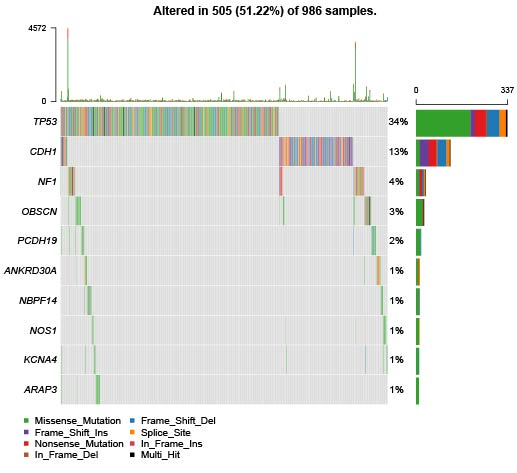

```{r setup, include = FALSE}
knitr::opts_chunk$set(
  collapse = TRUE,
  comment = "#>"
)
require(SMDIC)
```


## 1 Introduce

We developed a novel software package (SMDIC) that enables automated identification of Somatic Mutation-Driven Immune Cell. The operation modes include inference of the relative abundance matrix of tumor-infiltrating immune cells, detection of differential abundance immune cells concerning the gene mutation status, conversion of the abundance matrix of significantly dysregulated cells into two binary matrices (one for up-regulated and one for down-regulated cells), identification of somatic mutation-driven immune cells by comparing the gene mutation status with each immune cell in the binary matrices across all samples, and visualization of immune cell abundance of samples in different mutation status for each gene. Here we present the flow diagram of SMDIC.
    

```{R}
#Flow diagram of SMDIC.
knitr::include_graphics("../inst/workflow.jpg")
```


SMDIC has three main functions (flow diagram): <br/>
(A) inferring the relative abundance matrix of tumor-infiltrating immune cells <br/>
(B) detecting differential abundance immune cells concerning a particular gene mutation status and converting the abundance matrix of significantly dysregulated immune cells into two binary matrices (one for up-regulated and one for down-regulated cells) <br/>
(C) identifying somatic mutation-driven immune cells by comparing the gene mutation status with each immune cell in the binary matrices across all samples. <br/>

This vignette illustrates how to easily use the SMDIC package. With the use of functions in this package, users could identify the immune cells driven by somatic mutations in the tumor microenvironment.

+  This package provides the `exp2cell` function to use gene expression profile to quantify the cell abundance matrix.

+   This package provides the `maf2matrix` function to use mutation annotation file (MAF) format data to build a binary mutations matrix.

+  This package provides the `mutcorcell` function to identify the immune cells driven by somatic mutations in the tumor microenvironment. 

+  This package provides the `plotwaterfall` function to plot the waterfall for mutation genes that drive immune cells.

+  This package provides the `plotCoocMutex` function to plot the co-occurrence and mutual exclusivity plots for mutation genes that drive immune cells.

+  This package provides the `heatmapcell` function to draw clustered heatmaps for the cells driven by a somatic mutation.

+  This package provides the `survcell` function to draw Kaplan–Meier curves for survival in the above-median and below-median groups for cell risk score.


## 2 Example: The inference of the relative abundance matrix of immune cells

We can use the function `GetExampleData` to return example data and environment variables.

The function *exp2cell* can use gene expression profiles to quantify cell abundance matrix. 'exp2cell' provides three methods for estimating the relative infiltration abundance of different cell types in the tumor microenvironment (TME), which including xCell, ssGSEA estimated method proposed by Şenbabaoğlu et al. and CIBERSORT.Through these methods, the relative abundance matrix of immune cells is inferred with cells as the row and samples as the column.<br/>

We selected the breast cancer gene expression profile data in the GDC TCGA database for exp2cell and obtained the results of the cell abundance matrix. The commands are as follows.

```{r echo = T, results = 'hide'}
library(SMDIC)
#get breast cancer gene expression profile.
exp.example<-GetExampleData("exp.example")

# perform the exp2cell method. The method must be one of "xCell","ssGSEA" and "CIBERSORT".
cellmatrix.example<-exp2cell(exp.example,method="ssGSEA")

```
```{r}
#get the result of the exp2cell function
#view the first six rows and six columns of the cell abundance matrix.
head(cellmatrix.example)
```


## 3 Example: Use mutation annotation file (MAF) format data to build a binary mutations matrix

The somatic mutation data used in the package is the mutation annotation file (MAF) format. We extract the non-silent somatic mutations (nonsense mutation, missense mutation, frame-shift indels, splice site, nonstop mutation, translation start site, inframe indels) in protein-coding regions, and built a binary mutations matrix, in which 1 represents any mutation occurs in a particular gene in a particular sample, otherwise the element is 0. The genes with a given mutation frequency greater than a threshold value (one percent as the default value) are retained for the following analysis.

We selected the breast cancer somatic mutation data in the GDC TCGA database for maf2matrix and obtained the results of a binary mutation matrix. The commands are as follows.

```{r}
# get the path of the mutation annotation file.
maf <- system.file("extdata","example.maf.gz",package = "SMDIC") 

# perform the maf2matrix method.
mutmatrix.example<-maf2matrix(maffile = maf,percent = 0.01) 

#get the result of the exp2cell function
#view the first six rows and six columns of the binary mutations matrix
head(mutmatrix.example)[1:6,1:6]
```


## 4 Example: Identification of somatic mutation-driven immune cells.

For a particular mutation gene, we compare the binary mutation vector with each binary cell abundance vector in the up-regulated or down-regulated immune cell-matrix respectively, and a 2×2 contingency table is constructed.Fisher's exact test is applied to recover the cells that had drastic mutation-correlated up-regulated or down-regulated response. This process is repeated for each immune cell in the binary abundance matrices. To correct for multiple comparisons, we adjust the exact test p-values by using the false discovery rate (FDR) method proposed by Benjamini and Hochberg. The immune cells with the default FDR<0.05 are deemed as statistically significant mutation-correlated, and which may be driven by the somatic mutation. We repeat the above process for each mutated gene. <br/>

The "mutcorcell" function is implemented to identify somatic mutation-specific immune cell response by inputting the abundance matrix of immune cells and binary mutations matrix. This function firstly detects differential abundance of immune cells concerning a particular gene mutation status with the Significance Analysis of Microarrays (SAM) method. Function `mutcorcell` detects the differential immune cells concerning a particular gene mutation status and construction of two binary matrices based on the abundance matrix of significant differential immune cell (one for up-regulated and one for down-regulated), identification of somatic mutation-driven immune cells by comparing the gene mutation status with each immune cell in the binary matrices. 

We selected the abundance matrix of immune cells and binary mutations matrix for mutcorcell and obtained the results of A list of four matrices. <br/>
* A binary numerical matrix which shows the immune cells driven by somatic mutant gene; <br/>
* Two numerical matrices which show the pvalue and fdr of the immune cells driven by somatic mutant gene; <br/>
* A character matrix which shows the cell responses of the immune cells driven by a somatic mutant gene.<br/>
The commands are as follows.

```{r import, results = "hide"}
# get breast cancer cell abundance matrix, which can be the result of exp2cell function.
cellmatrix<-GetExampleData("cellmatrix") 

# get breast cancer binary mutations matrix, which can be the result of maf2matrix function.
mutmatrix<-GetExampleData("mutmatrix")

# perform the function `mutcorcell`.
#mutcell<-mutcorcell(cellmatrix= cellmatrix,mutmatrix = mutmatrix,fisher.adjust = TRUE) 

#get the result of the `mutcorcell` function
mutcell<-GetExampleData("mutcell")

# the binary numerical matrix which shows the immune cells driven by somatic mutant gene.
mutcell$mut_cell[1:6,1:6]

#the numerical matrix which shows the pvalue of the immune cells driven by a somatic mutant gene
#mutcell$mut_cell_p

#the numerical matrix which show the fdr of the immune cells driven by somatic mutant gene
#mutcell$mut_cell_fdr

#the character matrix which shows the cell responses of the immune cells driven by a somatic mutant gene."up" means up-regulation, "down" means down-regulation, and "0" means no significant adjustment relationship
#mutcell$mut_cell_cellresponses
```
* tip: The binary matrix can not only come from the maf2matrix function but also any binary mutations matrix, in which 1 represents any mutation occurs in a particular gene in a particular sample, otherwise the element is 0. * 


Function *mutcellsummary* produces result summaries of the results of  *mutcorcell* function. The summary has four columns. The first column is gene names, the second column is the cells driven by the gene, the third column is the number of cells driven by the gene, the fourth column is mutation rates of the gene.<br/>

We selected the result of *mutcorcell* function, a binary mutations matrix and a cell abundance matrix for *mutcellsummary* and obtained the summaries of *mutcorcell* function.<br/>
The commands are as follows.

```{R echo=TRUE}
# perform the function mutcellsummary
summary<-mutcellsummary(mutcell =mutcell,mutmatrix = mutmatrix,cellmatrix = cellmatrix)

# get the result of the mutcellsummary function
head(summary)
```


Function *gene2cellsummary* produces result summaries of the immune cells driven by a somatic mutation. The summaries are a matrix that shows the short name, full name, pvalue, fdr, cell responses(up or down) of the cells driven by a somatic mutation.<br/>
We selected the result of *mutcorcell* function, the method we use in exp2cell  and a gene we are interested in for *gene2cellsummary* ,and obtained the result summaries of the immune cells driven by a somatic mutation.<br/>
The commands are as follows.


```{R}
# perform the function gene2cellsummary
gene2cellsummary(gene="TP53",method="xCell",mutcell = mutcell) 
```

## 5 Example: Visualization

We provide a set of visual analysis functions including `heatmapcell`,`plotwaterfall`,`plotCoocMutex` ,and `survcell`.<br/>

Function `heatmapcell` is a function to draw clustered heatmaps for the cells driven by a somatic mutation.<br/>
The commands are as follows.

```{r fig.height=6, fig.width=8}
# load dependent package.
require(pheatmap)

# plot significant up-regulation or down-regulation cells heat map specific for breast cancer
heatmapcell(gene = "TP53",mutcell = mutcell,cellmatrix = cellmatrix,mutmatrix = mutmatrix)
```

Function `plotwaterfall` and `plotCoocMutex` provide visualization of the mutation genes correlated with immune cells using a waterfall plot and mutually exclusive or co-occurring plot.<br/>

The commands are as follows.

```{r echo=TRUE}
#maf<-"dir" 
#tips: dir is the name of the mutation annotation file (MAF) format data. It must be an absolute path or the name relative to the current working directory.

#plot the waterfall for mutation genes which drive immune cells
#plotwaterfall(maffile = maf,mutcell.summary = summary,cellnumcuoff =4)

#plot the co-occurrence and mutual exclusivity plots for mutation genes that drive immune cells.
#plotCoocMutex(maffile = maf,mutcell.summary = summary,cellnumcuoff =4)

#view the result of the plotwaterfall function


#view the result of the plotCoocMutex function

```


Function `survcell` draws Kaplan–Meier curves for survival in the above-median and below-median groups for cell risk score. The cell risk score is calculated by the weighted mean of cells driven by a gene mutation, where the weight of cells is estimated by the "Univariate" or "Multivariate" cox regression.

```{r}
# get the result of `mutcorcell` function.
mutcell<-GetExampleData("mutcell") 

# get the result of `exp2cell` function.
cellmatrix<-GetExampleData("cellmatrix") 

#get the survival data, the first column is the sample name, the second column is the survival time, and the third is the survival event.
surv<-GetExampleData("surv")

#draw Kaplan–Meier curves
survcell(gene ="TP53",mutcell=mutcell,cellmatrix=cellmatrix,surv=surv,palette = c("#E7B800", "#2E9FDF"))
```


